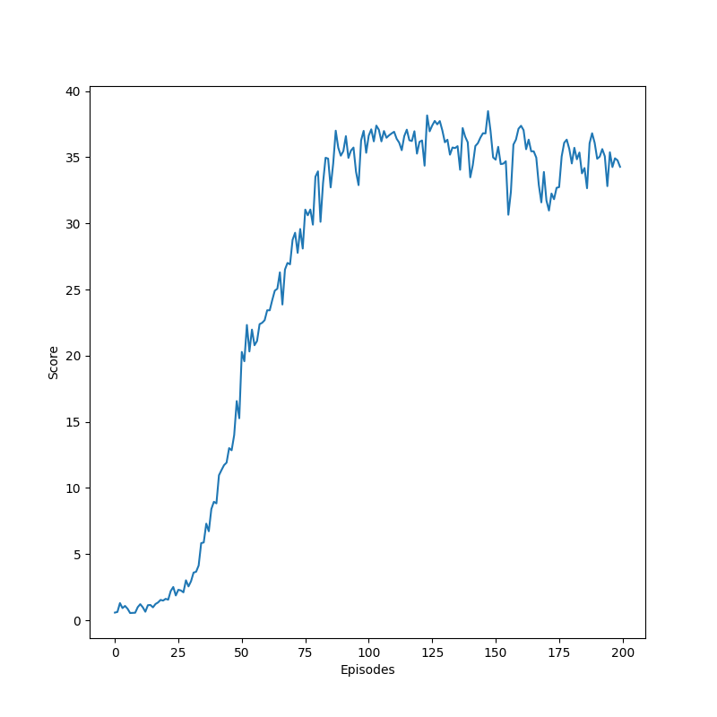

# Report

The agent is able to solve the environment in 150 episodes on average. The code is adapted from the ddpg repository. It is compatible with both versions of the environment, but the provided results are for the second version with 20 agents.

## Learning Algorithm 
The [DDPG algorithm](https://arxiv.org/abs/1509.02971) was used. The basic model is not able to solve the environment. The baseline implementation consists of training loop, agent and replay buffer. The implementation was amended by adding compatibility with second version of the environment. 

### Model

Two types of the deep neural network were used, actor and critic models.

The actor architecture is based on 4 fully connected layers.

* FullyConnected shape: <state_size, 128>
* FullyConnected shape: <128, 256>
* FullyConnected shape: <256, 128>
* FullyConnected shape: <128, action_size>

The critic architecture is similar:

* FullyConnected shape: <state_size, 256>
* FullyConnected shape: <256 + action_size, 256>
* FullyConnected shape: <256, 128>
* FullyConnected shape: <128, 1>

For this project state_size is equal to ```33```, and action size is equal to ```4```. The ReLU and LeakyReLu functions were used as activation for the actor and critic models respectively.

### Optimizer
To optimize the weights of the models the agent uses Adam algorithm. Ornstein-Uhlenbeck noise is scaled by the factor 0.1 compared to the standard ddpg implementation. During training the update is being applied 10 times after every 20 timesteps.

### Hyperparameters
All hyperparameters are stored at the top of the ddpg_agent.py file. All of them are listed below.

PARAMETER  | Description | Default value
------------ | -------------| -------------|
GAMMA  | Discount factor | 0.99
TAU  | Controls soft update of a target network| 1e-3
BATCH_SIZE  | Batch size | 128
BUFFER_SIZE   | Replay buffer size | 2e5
LR_ACTOR   | Learning rate of the actor model | 1e-4
LR_CRITIC   | Learning rate of the critic model | 4e-4
UPDATE_EVERY   | How often turn on learning | 20
UPDATES   | How many updates during learning | 10
AGENTS   | The number of agents | 20

## Results
The saved weights are in the files ```checkpoint_actor.pt``` and ```checkpoint_critic.pt``` for actor and critic respectively. The task was solved in ```147``` episodes. Best average score over 100 consecutive episodes is ```35.56```. The scores are plotted below.



```Logs from the terminal:```
```
'Academy' started successfully!
Unity Academy name: Academy
        Number of Brains: 1
        Number of External Brains : 1
        Lesson number : 0
        Reset Parameters :
                goal_speed -> 1.0
                goal_size -> 5.0
Unity brain name: ReacherBrain
        Number of Visual Observations (per agent): 0
        Vector Observation space type: continuous
        Vector Observation space size (per agent): 33
        Number of stacked Vector Observation: 1
        Vector Action space type: continuous
        Vector Action space size (per agent): 4
        Vector Action descriptions: , , , 

Episode 100     Average Score: 16.87    Time: 6.88
Episode 147     Average Score: 32.15    Time: 6.81
Environment solved in 147 episodes!     Average Score: 32.15
Episode 200     Average Score: 35.49    Time: 6.89
Best average score: 35.561539205137734
```
## Ideas for Future Work

There are many other potential algorithms that can solve the task. My plans are listed below:

-  Implement PPO.
-  Implement D4PG.
